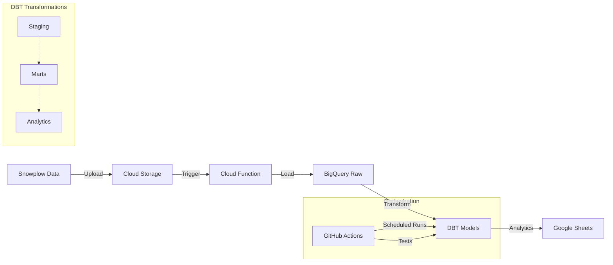

# Snowplow Analytics Project

## Project Overview
This project processes and analyzes user behavior data from Snowplow Analytics. The original task requested AWS and Databricks, but I implemented a similar solution using Google Cloud Platform (GCP) services, DBT Core and GitHub Actions.

### Technology Replacements
- AWS → Google Cloud Platform (GCP)
- Databricks/dbt → BigQuery/dbt
- AWS Lambda → Cloud Functions
- AWS S3 → Google Cloud Storage

## Data Products
1. BigQuery Tables
   - raw_events: Raw Snowplow data
   - staging_snowplow_events: Cleaned event data
   - dim_users: User dimensions and metrics
   - fct_sessions: Session-level facts
   - user_engagement: Analytics and insights

2. Connected Google Sheets
   - Snowplow data model (connected to dim_users and fct_sessions): [Google Sheet](https://docs.google.com/spreadsheets/d/1SzLXdHWpabiICFUMr4IgQg3PPa4eYQI92yaGMj3I934/edit?usp=sharing)


## Architecture


[Space for GCP Resources Screenshots]

## Setup Instructions

### 1. GCP Setup
```bash
# Login to GCP
gcloud auth login
gcloud auth application-default login

# Create project
gcloud projects create lego-tracking-analytics
gcloud config set project lego-tracking-analytics

# Enable billing (do this in GCP Console)

# Create buckets
gsutil mb -l EU gs://lego-tracking-raw
gsutil mb -l EU gs://lego-tracking-dbt-logs

# Create dataset
bq mk --dataset lego_tracking
```

### 2. DBT Setup
```bash
# Install DBT
pip install dbt-bigquery

# Verify installation
dbt --version

# Initialize project
dbt init lego_tracking_dbt

# Test connection
dbt debug
```

### 3. Cloud Function Setup
```bash
# Make scripts executable
chmod +x cloud_function/deploy.sh
chmod +x cloud_function/enable_apis.sh
chmod +x cloud_function/iam.sh

# Enable APIs and set up IAM
./cloud_function/enable_apis.sh
./cloud_function/iam.sh

# Deploy function
./cloud_function/deploy.sh
```

### 4. GitHub Actions Setup
1. Create secrets in repository:
   - GCP_CREDENTIALS: Service account JSON
   - GCP_PROJECT_ID: lego-tracking-analytics

[Space for GitHub Actions Screenshots]

## Project Structure
```
.
├── README.md
├── .github/                # GitHub Configuration
│   └── workflows/          # GitHub Actions Workflows
│       └── dbt.yml         # DBT pipeline configuration
├── cloud_function/         # Cloud Function code
├── lego_tracking_dbt/      # DBT project
└── sample_data/            # Test data
```

### Cloud Function Files
- `main.py`: Loads data from Cloud Storage to BigQuery
- `requirements.txt`: Python dependencies
- `deploy.sh`: Deployment script
- `enable_apis.sh`: Enables required GCP APIs
- `iam.sh`: Sets up permissions

### DBT Models
1. Staging Layer (`models/staging/`)
   - `stg_snowplow_events.sql`: Cleans raw events data
   - `schema.yml`: Column definitions and tests

2. Marts Layer (`models/marts/`)
   - `dim_users.sql`: User dimensions
   - `fct_sessions.sql`: Session metrics

3. Analytics Layer (`models/analytics/`)
   - `user_engagement.sql`: User behavior analysis

### GitHub Actions Workflow
The project uses GitHub Actions for:
- Automated daily data transformations
- Running dbt tests
- CI/CD pipeline

Key workflow features:
- Runs daily at 5 AM UTC
- Uses service account authentication
- Caches Python dependencies
- Executes dbt models in stages
- Reports any test failures

## Future Extensions
1. Data Quality
   - Add more data quality tests
   - Implement data freshness checks
   - Add unit tests and E2E testing

2. Analytics
   - More models/view
   - Dashboards
   - ML and AI magic

3. Infrastructure
   - Monitoring and alerting
   - Data backup strategy
   - Performance optimization
   - Cost monitoring
